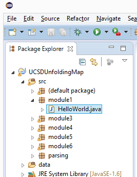
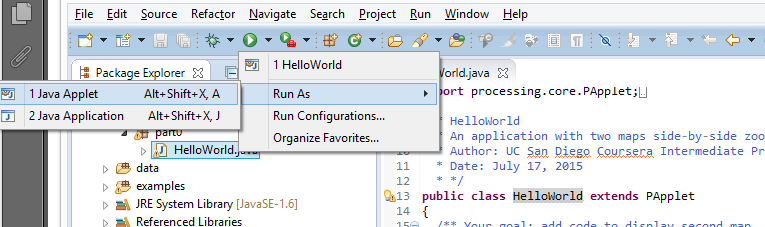
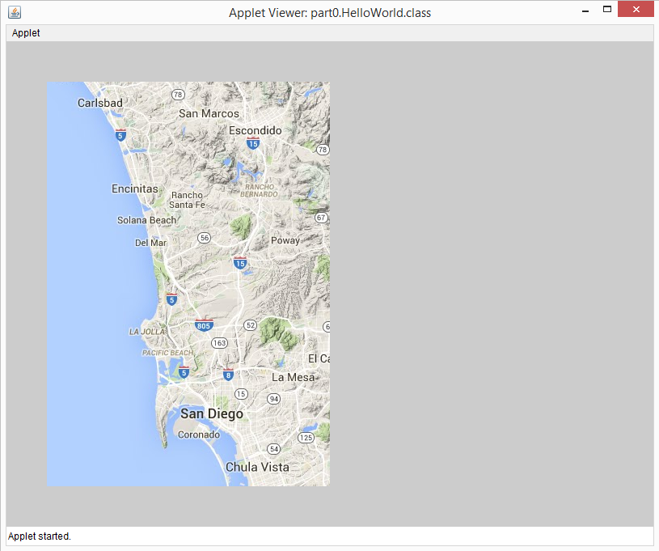
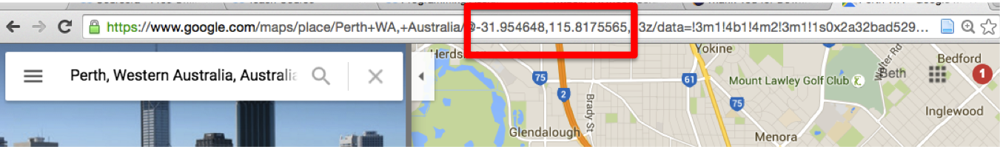

# Programming Assignment Instructions

## Programming Assignment for Module 1: Displaying Maps

### In this assignment you will...
- Set-up the Eclipse IDE with the UCSDUnfoldingMap libraries
- Create and organize new files (projects, packages, classes) in Eclipse
- Compile and run a program in Eclipse
- Use documentation to add code to a program

### Instructions
This is your first programming assignment of the course. All the other assignments will build on this one as you create your project. 

Before you can start programming your project, you need to set up your environment (IDE). Detailed setup instructions are linked here: https://www.coursera.org/learn/object-oriented-java/supplement/zqSRy/setting-up-java-eclipse-and-unfolding-maps. You’ll need an internet connection for that part.

If you've already got eclipse and Java set up and you just need the UnfoldingMaps library, you can find the starter code linked from the set up guide above.

To get started with this code:
1. You can watch our setup video on how to create your Eclipse project https://www.coursera.org/learn/object-oriented-java/lecture/f1CgB/projectsetting-up-the-starter-code-in-eclipse, 
2. Read our setup guide (https://www.coursera.org/learn/object-oriented-java/supplement/zqSRy/setting-up-java-eclipse-and-unfolding-maps), 
3. Or if you're comfortable in Eclipse, just unzip this code and then import it as an existing project in Eclipse.

Now you’ll start building your own interactive world map.

Instead of trying to write all the code from scratch, you’ll do what professional developers do all the time and work with existing libraries.  In particular, you’ll use the UnfoldingMaps library.  As part of the setup instructions, you downloaded the files you need to start using Processing and Unfolding Maps as well as all of the starter code for all of the assignments in this course.  Now, it’s your turn to explore this library and build something new.

__1. Open your UCSDUnfoldingMap project in eclipse__, if it’s not already open

__2. Open HelloWorld.java for editing (NOT HelloUCSDWorld.java)__:  All of the starter code for all of the programming assignments in this course came with the UCSDUnfoldingMap eclipse project you downloaded and set up.  In the Package Explorer window on the left, when you expand the src folder, you will see several packages underneath.  Expand the module1 package and you will see the file HelloWorld.java:

Open this file for editing by double-clicking on it. __Don’t peek ahead at other module packages as these have the answers to earlier assignments in them!__

When you open HelloWorld.java, you might see some warnings of the sort “The serializable class HelloWorld does not declare a static final serialVersionUID field of type long”.  Don’t worry about these.  However, you should not see any errors (which would be displayed in red).  If you do, something has gone wrong in your setup and you should try to fix it now.

(Programmers’ inside joke: when you start off learning a new programming language or skill, often the first code you write is to display “Hello World!” in some way.   Your first program will be *literally* displaying the world using UnfoldingMaps.)

__3. Run this code as an Applet.__

IF YOU ARE NOT CONNECTED TO THE INTERNET, you must first change the value of the variable offline to be true.  This will cause the program to use the provider which uses the maps that have been downloaded locally to your machine, and change the zoom level.  In the starter code look for the phrase “IF YOU ARE WORKING OFFLINE” to find the offline variable.

There are many ways to run this program as an Applet, but a simple way is to click on the arrow next to the green circle with a white arrow at the top of the page, and from the pulldown menu select Run As -> Java Applet.

When you run the Applet, you should see a window that looks like the following screenshot. It might take a really long time to load, 30 seconds or more.  That’s normal.  You’ll be able to reduce this time by playing around with simpler map providers. (IF YOU ARE WORKING OFFLINE, the map will be considerably simpler and zoomed out.) 

This is our “hometown.”  We are a bit North of where it says “LA JOLLA”, about where the “5” interstate marker is, at UC San Diego. 

__4. Add code to the file so that your applet does the following__ (see the hints that follow for help if you need it):
- Display a second map next to the default one.  This map should be zoomed into your hometown by default -- see hints below for how to find your hometown latitude and longitude.

After completing the above task, you are “done” with this assignment and ready to take the programming assignment quiz.  However, we encourage you to keep going, if you are inspired, and have fun playing around.

### Hints for completing this assignment
We realize that some of this code may seem overwhelming/mysterious right now.  But for this assignment, you can probably figure out everything to do by reading the starter code, including the comments (which give lots of hints).  You basically just need to copy and paste or modify commands that are already in the starter code to complete the assignment.  Don’t worry if you don’t fully understand the code you write.  We’ll get into it in more detail throughout the course.

__Create a second map:__ Start by simply getting a second map to display.  Don’t worry about its exact location on the screen, position, map provider, etc. yet.  Then, once you have the map displayed, you can work on meeting all the requirements for this part one at a time.

__What to modify:__ You will need to write code in both the setUp method and the draw method.  You shouldn’t need to modify anything else.

__How to find your hometown latitude and longitude:__  One way is to open google maps and type in your city.  Then, look in your browser address bar, and you can find the latitude and longitude numbers.  For example, if I live in Perth, Australia then I can find out my latitude is -31.9 and my longitude is 115.8.

__Coordinates are different in computer graphics:__  As you try to add your new map to the right of the present map, you will want to have a starting location different than the provided map which starts at 50,50 (x and y values, respectively). For those of you new to graphics, beware, y values behave differently on computer screens than in Cartesian coordinates. ___For pixels, larger y values appear lower on the screen that smaller y values.___  This is because the axis (0,0) is in the top left of a computer screen (not the bottom right, as you might assume from Cartesian coordinates).  The x-axis will likely behave as you expect.  In both computer graphics and Cartesian coordinates, larger x values are more to the right than smaller x-values.   

__Ideas for extensions:__ If you would like to look at the documentation (perhaps to make some fancy extensions), the best places to look are:
- http://unfoldingmaps.org/javadoc/, and in particular look at the UnfoldingMap class
- https://processing.org/reference/ for background colors/patterns

__Optional - Changing Map Provider:__  If you are working online, feel free to try to use a different Map Provider for each of the two maps.   (NOTE: If you are working offline, you should not change the map provider - you should use the “dark” tiles which are in the file “blankLight-1-3.mbtiles.” )

A full list of map providers can be found here:

http://unfoldingmaps.org/javadoc/de/fhpotsdam/unfolding/providers/package-summary.html 

We know that the GoogleMapProvider works (as do the other Google providers, last we checked).  The Microsoft providers (HybridProvider, AerialProvider, and RoadProvider) also are known to work.  However, we have not tried all of the providers listed on the page above, and some (or many) may not work.  Play around if you like, but feel free to use one of the Google or Microsoft providers that we know work.

__NOTE__ - If you being receiving an error like this "java.io.IOException: Server returned HTTP response code: 403 for URL: http://mt1.google.com/..." you may have exceeded the number of allowed queries to Google for the day. Feel free to use an alternative map provider or work offline if this happens. Learners have reported that you will only be blocked for 24 hours from google so you can restore using the provider at that time.