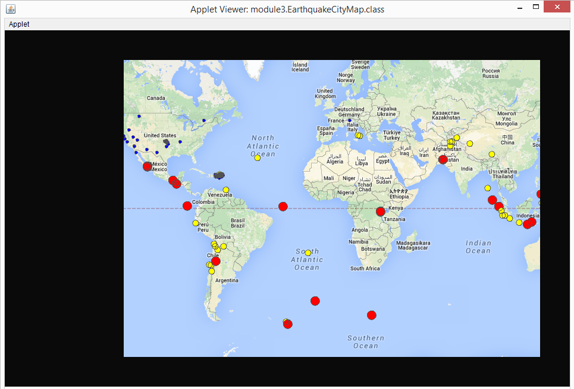
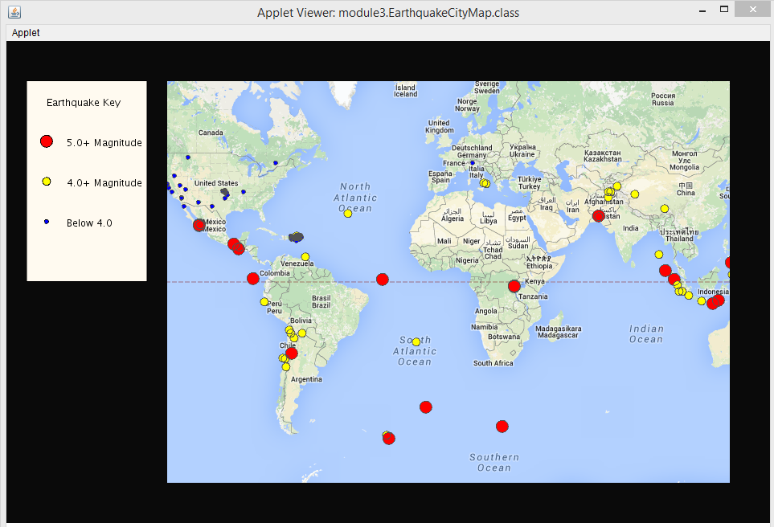

# Programming Assignment Instructions

## Programming Assignment for Module 3: Putting Data on a Map

### Learning outcomes
- Describe the components of a GUI in Java (using PApplet)
- Create a GUI with code
- Use Processing and Unfolding Maps library functions
- Read and apply Java documentation
- Use helper functions to organize more complicated code

### Introduction
Data visualization is a powerful technique for spotting trends. In this programming assignment, you will write a program that helps visualize earthquake data. Earthquakes are happening daily around the world. Geological analysis suggests which locations will be prone to higher seismic activity. You will plot recent earthquakes on a map to highlight potential disaster zones.

As you work on this project, keep in mind that most of your code will work equally well with any other geotagged data: from disease outbreaks to airplane crashes to discoveries of resource-rich mines, and beyond!

Your map will read earthquake data from a live RSS feed (an online source of frequently updated data, see [Wikipedia entry](https://en.wikipedia.org/wiki/RSS) for details): http://earthquake.usgs.gov/earthquakes/feed/v1.0/summary/2.5_week.atom. You will then plot markers in the locations where earthquakes of magnitude 2.5 or higher have occurred in the last week. Then, you will customize your map and markers.

__NOTE FOR LEARNERS WORKING OFFLINE:__ You will not be able to use a live RSS feed, but we have provided a stored feed in the starter package you downloaded and set up last week.  Watch for instructions for learners working offline for how to use it. In addition, we expect you to work with online documentation in this module. You can download some of this documentation to use offline. There is a note below about what you will need.

As you saw (or will see) in the videos from this module, we’ll organize our data into features and markers. A feature is a class of objects which stores one or more locations, its type, and any additional data properties associated with it. In our case, we will need a List of features which store the location of each earthquake in the past week, and additional properties associated with it (magnitude, age, elevation, title).

To display the features, you will use markers. A marker is a class of objects that give us a visual representation of a feature, which at the simplest level is a dot at the corresponding latitude. A marker does not, however, have to be associated with a feature as all we need is a location to draw it. For example, if we just wish to draw a point at a major city (e.g. Tokyo) there's no need for a feature unless we wish to store other information about the city.

### Resources to have open
In this assignment we will expect you to work with the documentation for both Unfolding Maps and Processing. You should open these links now:
- http://unfoldingmaps.org/javadoc/ In particular, the classes UnfoldingMap, SimplePointMarker, PointFeature and the Marker interface
- https://www.processing.org/reference/ In particular the methods: text(), rect(), ellipse(), and fill() will come in handy. 

We have also provided a [guide to understanding Features and Markers](https://www.coursera.org/learn/object-oriented-java/supplement/EUBIS/support-understanding-features-and-markers) to help you with these programming assignments.

__IF YOU ARE WORKING OFFLINE__, you can download these documentation pages when you have an internet connection.

### What you will do
Just like before, we provide some skeleton code to get you started.  To complete this assignment, do each of the following steps:

__1. Open the starter file for this assignment:__ In the eclipse Package Explorer, expand the module3 package. You should see the file EarthquakeCityMap.java. Double click on that file to open it. Again, don’t peek ahead at the rest of the packages. There is a file with the same name in the future module packages.  Make sure you open the one in the module3 package.

__2. Trace the starter code, predict what happens when you run it, and then run it__ to check whether you were right.  Note that we don’t expect you to trace the ParseFeed code.  You can, but it’s OK if it doesn’t make much sense to you.  Also, we know you may be tempted to skip the prediction step, but it’s extremely good practice to trace code and explain what it is doing without actually running it, so we strongly encourage you not to skip this step! Hint: it doesn’t do very much yet.

__NOTE TO LEARNERS WORKING OFFLINE:__ You will once again have to set the value of the variable offline to true so that the code uses the local map tiles and local earthquake data.  Your map will look slightly different than the one above.

__3. Add code to display a marker__ at the location of each earthquake in the RSS feed. After this step, your program should look like the following:

__Hints for step 3__
- In the setup method, you should create a SimplePointMarker object for each PointFeature in the list features, inside the setup method. You will need to add a loop where the comments indicate to do so.  Inside the loop you will call the method createMarker to create a new SimplePointMarker for each PointFeature in the List earthquakes.  Then you will add each new SimplePointMarker to the markers List. 

- Do not call the draw method on the markers.  That method will be called automatically for you when you add the markers to the map.  As long as you have added the SimplePointMarkers to the markers list, they will be displayed automatically on the map because the last line of setup adds all of the Markers in the markers list to the map.  If you are not seeing any markers, it's because you have not correctly added the new markers to the markers list.

__4. Add code to the createMarker method to style each marker__ according to the magnitude of its earthquake.  You can be creative here, but as a minimum you should have the size and color change for at least 3 different levels of earthquake.  For example, 
- Minor earthquakes (less than magnitude 4.0) will have blue markers and be small.
- Light earthquakes (between 4.0-4.9) will have yellow markers and be medium size.
- Moderate and higher earthquakes (5.0 and over) will have red markers and be largest.

You can find out more about earthquake classification here: http://www.geo.mtu.edu/UPSeis/magnitude.html

Your applet might look something like:

And remember you can pan and zoom to explore the map.

__Hints for step 4__
- You’ll likely find the UnfoldingMaps javadoc helpful. We recommend you look at the Marker interface.  For reasons we will learn next week, all of the Marker methods can be called on SimplePointMarker objects.  
- One method you’ll likely find particularly helpful is the setColor method.  This takes an int in “Procesing format”.  To generate the int in the correct format, use the “color” method in the PApplet class.  It takes 3 int arguments: red, green and blue and returns an int in the correct form to pass into setColor.  e.g. int myColor = color(100, 120, 200);
- There is code in the starter file that demonstrates how to get properties out of each earthquake feature, as well as how to use the color method mentioned above.  In addition, the starter code will print out all of the available properties of earthquake features if you uncomment the line that does so.  If you want to get a feature out of the PointFeature object, you simply pass in the relevant string to the getProperty method of the feature to get the corresponding property object out.

__5. Add code to draw a key__ describing the style, and display it to the left of the map. Use the drawing methods found in the PApplet class to draw the shapes which look like the markers used and add the corresponding text next to it. Implement this in the addKey method which will be called from the draw method.

__Hints for step 5:__
- For this part you will find the Processing graphics methods useful. You can find the reference here: https://www.processing.org/reference/ In particular the methods: text(), rect(), ellipse(), and fill() will come in handy, but you can (and should) also feel free to explore and use any other method you think would be useful. We also encourage you to make your key prettier than ours!
- When drawing text, use the fill method to set the color of the text. You can also play around with fonts and alignment, as is shown in some of the examples on the Processing references:https://www.processing.org/reference/text_.html and https://www.processing.org/reference/textAlign_.html

__6. (Optional) Add your own extensions.__ Get creative and make your map pretty. Or play around with using different earthquake feeds to see more or fewer earthquakes, which you can find here: http://earthquake.usgs.gov/earthquakes/feed/v1.0/atom.php. You just need to change the earthquake URL in your code to point to the feed you are interested in. Or if you have an idea of your own for an extension, go for it!  Then share your work with your family, your friends, or on the course discussion forum. We’re always interested in seeing your creativity.