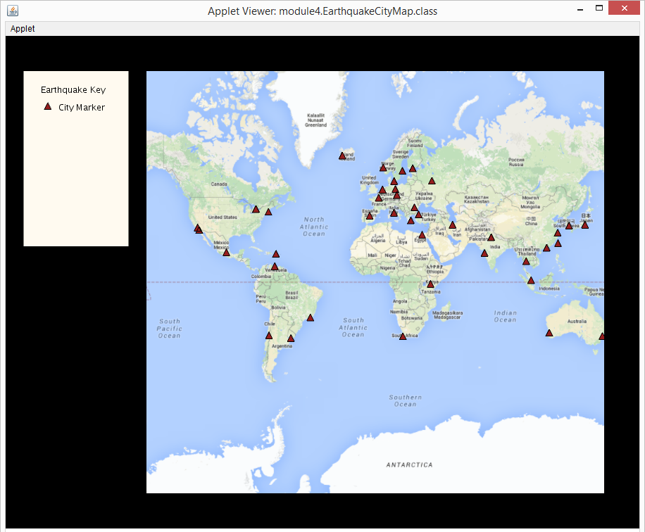
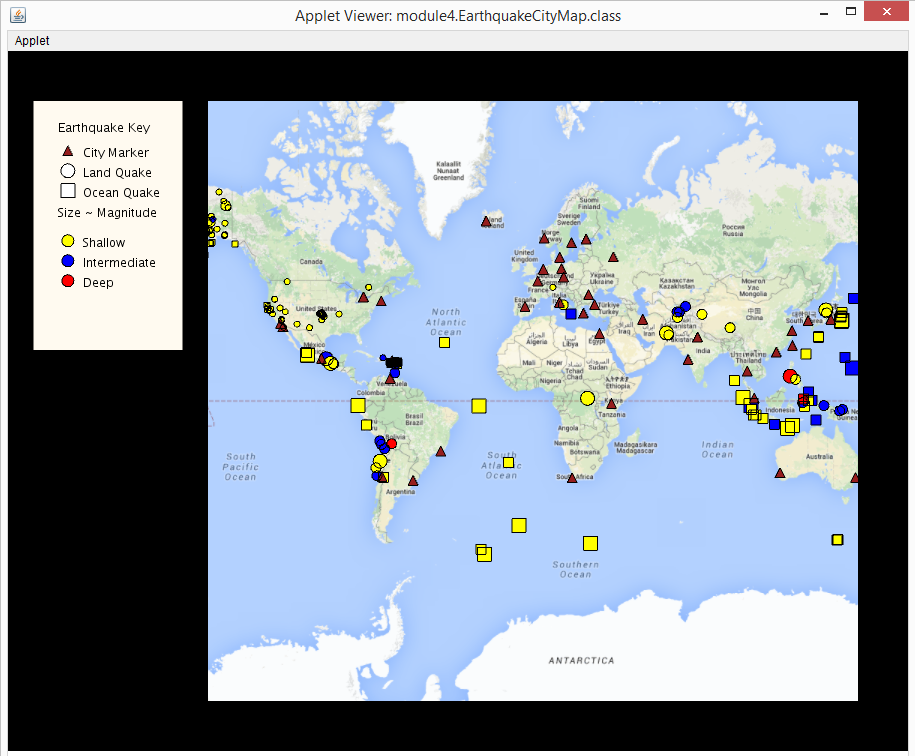
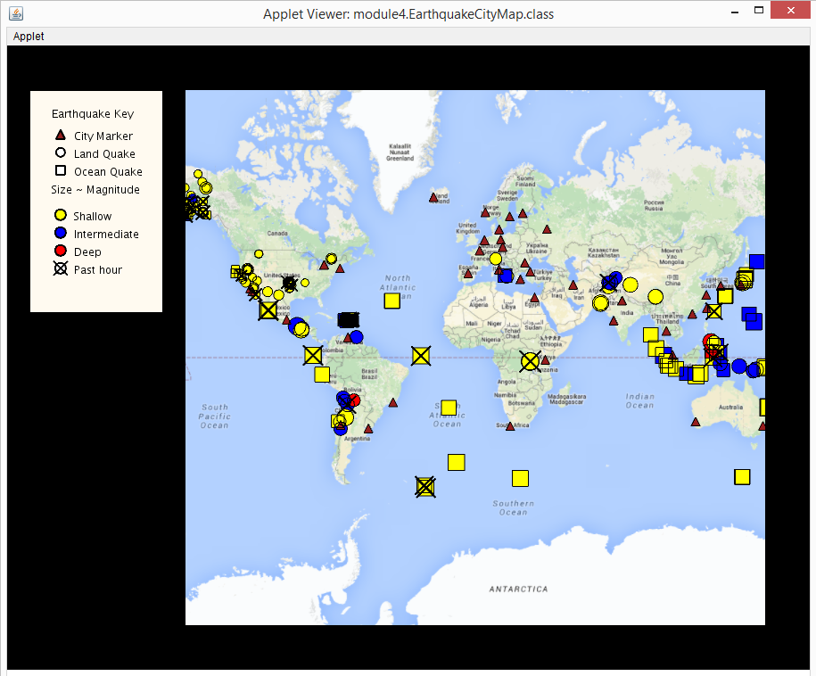

# Programming Assignment Instructions

## Programming Assignment for Module 4: Customizing Markers

### Learning outcomes:
- Organize a complex application by using several different classes.
- Build a class hierarchy to reflect the different kinds of markers for different categories of earthquakes.
- Write code to override methods in base classes.
- Write an abstract class that implements some methods and leaves others abstract.
- Use PGraphics methods to draw shapes.

### Introduction
First, we want to warn you that this is a challenging assignment. We've tried to add hints below and in the starter code, but if you get stuck, head to the discussion forum where you'll find additional hints and mentors available to help you with your questions.

In the part of the project you completed last week, you wrote all of your styling code for the earthquake markers in the createMarker method in the EarthquakeCityMap class and then called this method from setup. Now that you’ve learned about inheritance, you will use the power of class hierarchies to organize and improve your code while also adding new features.

The impact of an earthquake depends on many factors, including whether the epicenter is over land or in the ocean. Your class hierarchy will allow you to customize the earthquake marker for these different kinds of earthquakes.  You will write code in four different new classes: an abstract class named EarthquakeMarker and two classes extending it: LandQuakeMarker and OceanQuakeMarker, as well as another class CityMarker.

In each of these classes, you will override the draw() method. This method is executed automatically by the Processing PApplet in a loop for each of the markers you create. 

### Resources to have open
In this assignment we will again expect you to work with the documentation for both Unfolding Maps and Processing. You should open these links now:
- http://unfoldingmaps.org/javadoc/  In particular, the classes UnfoldingMap, SimplePointMarker, PointFeature and the Marker interface
- https://www.processing.org/reference/ In particular the methods: text(), rect(), ellipse(), and fill() will come in handy. 

We have also provided a [guide to understanding Features and Markers](https://www.coursera.org/learn/object-oriented-java/supplement/EUBIS/support-understanding-features-and-markers) to help you as you work through these programming assignments.  

__IF YOU ARE WORKING OFFLINE__, you can download these documentation pages when you have an internet connection.

### What you will do
Just like before, we provide some skeleton code to get you started.  Your goal will be to do the following:

__1. Find and open the starter code:__ You will find the starter code for this part of the project in the module4 package. Expand the module4 package in the package explorer and you will see 5 java files: EarthquakeCityMap.java , EarthquakeMarker.java, CityMarker.java, LandQuakeMarker.java, OceanQuakeMarker.java. You can open any of them by double-clicking on them. __Make sure you are working on the files in the module4 package and don't peek ahead to the other packages.__ We recommend making sure all other files are closed in Eclipse so you don’t get confused which file you are working on. 

In the data folder (which is at the same level as the src folder), you will also see a file named “city-data.json”.  You don’t have to modify that file, but if your favorite city is not there, you can add it by editing the file.  Just be sure to match the format and data of the other cities exactly!

__2. Trace the starter code (starting in setup in EarthquakeCityMap.java), predict what happens when you run it, and then run it.__ IF YOU ARE WORKING OFFLINE: Don’t forget to change the value of the offline variable to true, otherwise you will get an error. Notice that the file EarthquakeCityMap.java implements most of the functionality that you worked on in the programming assignment for module 3, but it's not exactly the same. Are you surprised by what happens (or doesn't happen) when you run it? 

__Hint for part 2:__ We’ll ask you about this behavior on the end of module assessment so you might want to make a note of what’s going on and why.

__3. Implement the isLand(Feature earthquake) method in EarthquakeCityMap.__ This method should return true if the location of the input earthquake is on land. It should also set the "country" property on the LandMarker to the country where the earthquake occurred. Otherwise, the location is in the ocean and the method should return false. You will test this method once you have implemented the next method.

__Hint for part 3:__ A location is on land if it is located in *some* country. So, you can loop through all countries and check if the location is in any one of them. You can (and should) use the helper method isInCountry() given in the file, which takes care of a lot of the work of isLand for you, including setting the "country" property of the earthquake PointFeature. There is not a lot of code to add for this part.

__4. Implement the printQuakes() method in EarthquakeCityMap.__ This method should use System.out.println() to list each country for which there was 1 or more earthquakes and the number of earthquakes detected in that country. Then it should print out the number of quakes that were detected in the ocean. Note that this method is not trivial. You will have to calculate the number of earthquakes per country from the information you have available.  As an aside: If you are running the applet with a large earthquake file/feed (e.g. 1.0+ Past week or 30 days), you might find that printQuakes takes a long time to run. Feel free to comment out the call to printQuakes() in setup once you get it working if you find this is the case.

__Hint for part 4:__ A straightforward solution uses a nested loop (over the countries and then the earthquakes). The solution need not be perfectly efficient (it's okay to loop over all the earthquakes many times). For more hints, please see the starter code and forum discussion.

__5. Test isLand and printQuakes.__ To facilitate basic runtimebenchmark, we have included two tester input files (test1.atom and test2.atom) and two files that include the expected output (test1.out.txt and test2.out.txt) for each of these test files. All files are in the data folder. You will see lines in the starter code for setup() that you can uncomment in order to run with the tester files. (Uncomment 1 line at a time). You can run each test and compare them to the test output, which you can open in eclipse by double-clicking it in the package explorer. If both outputs match, it is likely that you have implemented both isLand and printQuakes correctly. Note that order and formatting does not have to match. 

__6. Draw a UML (class hierarchy) diagram describing the inheritance relationship between the following classes/interfaces:__
- Marker
- AbstractMarker
- SimplePointMarker
- EarthquakeMarker
- LandQuakeMarker
- OceanQuakeMarker
- CityMarker

You will want to keep this diagram handy for the end of module assessment.  

__Hint for part 6:__ The javadocs for for the built-in classes (Marker, AbstractMarker, SimplePointMarker) will come in handy here: http://unfoldingmaps.org/javadoc/ then click on the classes you’re interested in in the list on the left. 

__7. Complete the method definition for the draw() method in the CityMarker class.__ We suggest you use triangles to represent cities, but of course the exact shape and color is up to you. Then add the marker to your key (which you will need to modify as you change your earthquake markers). Your map should now look something like the image below.

__Hint for part 7:__ Because you are no longer working in the PApplet class, you will need to use the PGraphics object for drawing. You can call the same methods you were calling when you were drawing on the PApplet, but you call them on the pg object. The arguments x and y should be used (and passed into your graphics calls) as the center of the Marker you are drawing. See the comments in the draw() method for an example of how to do this.

__8. Complete the method definitions for the drawEarthquake() method in LandQuakeMarker and OceanQuakeMarker__ so that the size of the marker varies by its magnitude (larger magnitude=larger marker). In addition, make the LandQuakeMarkers one shape (we suggest circles) and the OceanQuakeMarkers a different shape (we suggest squares). Be sure to center them at the x, y position passed in to drawEarthquake. Also, they will appear white for now. That’s OK. Do not set their color in drawEarthquake. That will be done in the next step. Then add your markers to the key.  Your map should now look something like the image below.  Make sure there is a visual difference between the size of the markers for different magnitudes. 

__Hint for part 8:__ You can scale the radius or use thresholds to set the size of the markers.

__9. Complete the method definition for colorDetermine() method in EarthquakeMarker__ and notice where it and the methods from the derived classes are called in the EarthquakeMarker’s draw method. You will be asked about the relationship between these methods on your self-assessment. 

The colorDetermine() method changes the color of the earthquake marker depending on whether the earthquake is shallow, intermediate, or deep, defined as follows:

“Shallow earthquakes are between 0 and 70 km deep; intermediate earthquakes, 70 - 300 km deep; and deep earthquakes, 300 - 700 km deep. In general, the term "deep-focus earthquakes" is applied to earthquakes deeper than 70 km. All earthquakes deeper than 70 km are localized within great slabs of shallow lithosphere that are sinking into the Earth's mantle.”

Source: http://earthquake.usgs.gov/learn/topics/seismology/determining_depth.php

Update your key to include this new information. Your map should now look like the image below.

__Hint for step 9:__ The Processing fill() method (https://www.processing.org/reference/fill_.html) sets the color for text and shapes. Do not use the color() method.

__10. (Optional) Modify the draw method so that it draws an X over all earthquake markers whose earthquakes have occurred in the last day.__ Hint: EarthquakeMarkers have an “age” property, and the value of this property can be: “Past Hour”, “Past Day”, “Past Week” or “Past Month”.  

Update your key to include this new information. Your map should look like this:

