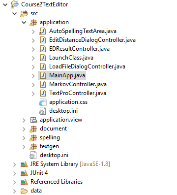

# Programming Assignment: How Easy to Read is Your Writing?

## Assignment Overview
In this first programming assignment, which is the first part of the project you will develop throughout this course, you will write code to analyze the reading level of a piece of text. The [Flesch Readability Score](https://en.wikipedia.org/wiki/Flesch%E2%80%93Kincaid_readability_tests) is a measure of the reading complexity of a piece of text. Developed by author Rudolf Flesch, it is a measure that approximates how easy a piece of text is to read based on the number of sentences, words and syllables in that text. Higher scores indicate text that is simple to read, while lower scores indicate more complex text.

In this programming assignment you will write the back-end code for calculating Flesch readability scores, and then you will integrate this back-end capability with the front-end application we provide that you will be adding to throughout this course.  

## Getting Set Up
__1. (If not already done) Download and set up the starter code__

Before you begin this programming assignment, you need to download and set up the starter code. You should have already followed the [instructions for setting up Java and Eclipse](https://www.coursera.org/learn/data-structures-optimizing-performance/supplement/amsdH/setting-up-java-and-eclipse). Make sure you have the most recent version of the starter code by checking the date the starter code was last updated. You are welcome to use any IDE of your choice, but we provide the starter code as an Eclipse project, so you'll probably find it easiest to work in Eclipse.

Make sure you've followed the setup instructions even if you've previously worked with Eclipse, and even if you took the first course in our series, because you'll need to make sure you have some additional pieces installed and set up (e.g. At least Java 1.8, JUnit).

__2. Verify that the front-end runs__

Make sure the project you downloaded and set up for this course is open in eclipse. 

As you saw in Mia's demo video, all of the functionality you will implement in this course will be integrated into a text editor application. You can already run this application, but it won't do much.

Run the text editor by running the MainApp class inside the application package. You can do this by expanding the application package in the package explorer and then selecting the MainApp.java file and running it.

You will see a text editor window open. You can type in the text window and load text using the "Load" button. None of the other buttons work yet (you can click them, but they don't do anything). But they will soon...

__3. Orient yourself to the starter code__

Open the starter code for this assignment by expanding the document package in the Package Explorer window. There you will see several files, but the two that are relevant to this assignment are Document.java and BasicDocument.java. Open these by double-clicking on them.  

Notice that Document is an abstract class.  BasicDocument will implement the abstract methods in the 
Document class using the guidelines below described in the parts below.  

## Assignment Details
This assignment is divided into two parts. You will submit a separate file for each part, as described below.

### Part 1: Implement the missing methods in BasicDocument.java
__1. Implement getNumSentences, getNumWords and getNumSyllables__ following the comments about how they are supposed to work that you will find in your starter code (the version uploaded June 22, 2016 or later has the most detailed comments). You'll probably also want to implement countSyllables(String) in Document.java, to be called in getNumSyllables.

You must follow the definitions of what constitutes a syllable, word and sentence given in the documentation for each function exactly to pass the graders.

We have provided you will several test cases in main as well as a helper method you can use to write your own tests.

__2. Part 1 Bonus (purely optional, just for fun):__  

Our REGEX are pretty naive. For example, the word 7.5 causes real problems for our expressions as a “.” usually denotes the end of a sentence. If you want to learn more about REGEX, you can improve upon our approach. But if you want to do this, put it in a separate class (like ImprovedDocument) and make sure you don't use it to produce your grading output.

### Part 2: Implement the getFleschScore method in Document.java
__1. Fill in the method getFleschScore() in Document.java__ to calculate the Flesch Score for the text in the document. You should use the following formula, and make calls to the getNumSyllables, getNumWords, and getNumSentences you just implemented.

You should test your code by calculating the Flesch score by hand on some very basic documents and then calling your method from main to make sure it's giving the same output. Or you can go ahead and run our grader before you submit, which you can find in the same package.

### Part 3 (optional, nothing to submit): Have fun with calculating the readability of text that you find
__1. Make your code work with the text editor application__

Currently, the text editor application is not set up to use the BasicDocument class (it uses EfficientDocument, which you will implement next week). So if you want your text editor application to calculate the Flesch score (after you finish part 2), you must change one line of code in the file LaunchClass.java, which is in the application package. In the method

public document.Document getDocument(String text)

change "document.EfficientDocument" to "document.BasicDocument". Remember to change this back next week!

Now that you've implemented the Flesch score, your GUI interface will automatically include this functionality. Try running it again, and playing around with calculating the Flesch score of various documents, either that you have produced or that you find on the web. We'd love to see fun things you discover on the discussion board!