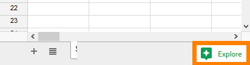

# Programming Assignment: Making Flesch Score Calculation More Efficient

## Assignment Overview
In this assignment, we’ll optimize the implementation of the Document class that you implemented in your last assignment, and then measure how much faster your new implementation is.

## Getting Set Up
Before you begin this assignment, make sure you check Part 2 in [the setup guide](https://www.coursera.org/learn/data-structures-optimizing-performance/supplement/amsdH/setting-up-java-eclipse-and-the-starter-code) to make sure the starter code has not changed since you downloaded it. If you are an active learner, you will have also received an email about any starter code changes. If there have been any changes, follow the instructions in the setup guide for updating your code base before you begin.

__1. (Optional) Download and use our solutions for Document.java and BasicDocument.java__
First, if you are feeling unsure about your Document.java solution, you are welcome to use ours. With Eclipse closed, __move your BasicDocument.java and Document.java files somewhere else, outside of your workspace.__  That is, on your file system, you should find these files in the MOOCTextEditor/src/document folder, and then move them somewhere else.  This is so that you don't lose them when you download our solution.  Then, download our BasicDocument.java and Document.java solution files from the following links and save them back into your MOOCTextEditor/src/document directory on your file system: [BasicDocument](https://d18ky98rnyall9.cloudfront.net/_0b78421c61dfc778be16077145e1f280_BasicDocument.java?Expires=1659139200&Signature=IYmUSmgxNk2lMWfnLpyrEwluT9oBVane9DC43hKPbNPg44SlffBFUcZYE9uj1avf8J-ddA6dqdi9B7bN~0sg0bbO5ULUf3NkVgrr-Xxbt66yy5uW3aC7V2tteoKmuQrCqOEOD9fu0gjnBeZYOXX6wjeqI7pTrHhA~NAvnREcx~E_&Key-Pair-Id=APKAJLTNE6QMUY6HBC5A), [Document](https://d18ky98rnyall9.cloudfront.net/_e6e4223336ad4e6cefda9c9f2e0bb3e1_Document.java?Expires=1659139200&Signature=eSQzL77QUktHKiXQgjSd17Ia0cmvI01be7EbqssDnobg8ibmdKlddTnjVhibYZChpiqUo-Z1Zn6VGub05Caioedjm69fbjQKUcqlxF3W6J60q8ETt8Psv81VU~PSyrgxVXJ9WwwfsaBTtuqH8nyR15PLxUBc4fnBnyiJjj-RkN4_&Key-Pair-Id=APKAJLTNE6QMUY6HBC5A).

__2. Start Eclipse and find the starter code for this assignment__

The starter code for this assignment can be found in the document package. You will be working with the files EfficientDocument.java and DocumentBenchmarking.java. You will need EfficientDocument.java for part 1 and DocumentBenchmarking.java for part 2. Open these two files now. 

__3. (If needed) Modify LaunchClass.java so that getDocument returns an EfficientDocument instead of a BasicDocument__ (only needed if you changed LaunchClass.java in week 1). If you modified LaunchClass.java so that its getDocument method returned a BasicDocument last week, you should modify it back to returning a document.EfficientDocument for this week's assignment.

## Assignment Instructions
This assignment has two parts.  The instructions below tell you how to produce the files you need to upload for a grade in each part.

### Part 1: Complete the Implementation of EfficientDocument
__1. Implement processText() in EfficientDocument.java.__

This method should make ONE pass through the tokens list and count the number of words, sentences and syllables in the document. It should store these values in the appropriate member variables so that when the method is over, they never have to be re-calculated.

You should make sure you understand the provided method getTokens, isWord, and the provided first line of code in the processText method.

IMPORTANT: Notice that countSyllables and isWord __do not__ use Matcher objects or regular expressions. This is important. It turns out that the process of creating a Pattern and a Matcher object for each word is slow enough that if you take this approach your EfficientDocument will end up being slower than your BasicDocument, because of the overhead of creating and destroying objects in memory. So use the single regex we provide at the start of the processText method, but don't try to use Patterns or Matchers on the individual tokens returned from the first call to getTokens.

__2. Implement getNumWords, getNumSyllables, and getNumSentences in EfficientDocument.java__

Once you have implemented the processText method, the implementations of these three methods is trivial.

You can again use the method testCase in the Document class to test the correctness of your implementation. We've provided a few test cases for you. You should add more.

### Part 2:  Benchmarking
Your next task is to determine and plot how much faster EfficientDocument is than BasicDocument in computing a single Flesch score for a document. 

__1. Calculate the Big-O running time of your code__ to compute the Flesch score for BasicDocument and EfficientDocument (including the time taken by processText!) and predict how the running time of calling fleschScore on BasicDocument and EfficientDocument will grow as the document size grows.  

__2. Open the file DocumentBenchmarking.java__, which you can find in the document package. You will be adding code to the main method, and you will find the method getStringFromFile useful for reading a specified number of characters from a text file.

__3. Complete the main method__ so that it prints a table with one column each for the amount of time it takes to create a BasicDocument or an EfficientDocument, respectively, and call fleschScore on it. Your table should look like the following:

NumberOfChars       |BasicTime              |EfficientTime
--------------------|-----------------------|------------------
5000                |[basic time 1]         |[efficient time 1]
10000               |[basic time 2]         |[efficient time 2]
15000               |[basic time 3]         |[efficient time 3]
...

Where the first column in the table prints the number of characters in the test, the second column is the amount of time it takes to create a BasicDocument with that many characters and call fleschScore on it, and the third column is the amount of time it takes to create an EfficientDocument with that many characters and call fleschScore on it.  In these timing calculations, you should include the time taken by both constructors (i.e. the time EfficientDocument takes
 calculating the number of words, syllables and sentences in the 
document), otherwise it's not a fair 
comparison at all!

Columns in the table should be separated with a \t character for easy copy and paste in the next section.  You can also write this table to a file if you want, but it's not necessary.

__4. Plot your results and compare them to your predictions.__ Copy the output of your program and paste it into a Google spreadsheet ([sheets.google.com](http://sheets.google.com/)). It should automatically paste into 3 columns.  Then, graph the data using the Explore button in the lower right corner, as shown in the image below.

Do your results look like what you expected them to?  If not, consider whether you've done something wrong in your code somewhere and try to fix it.  But remember that empirical tests always have some noise, so some deviations from "perfect" data are expected.  

**To better understand your results, we strongly encourage you to discuss your results on the discussion forum**

Working with real data is fun, but is best done when you have someone else to talk about it with to make sure you really understand what's going on.