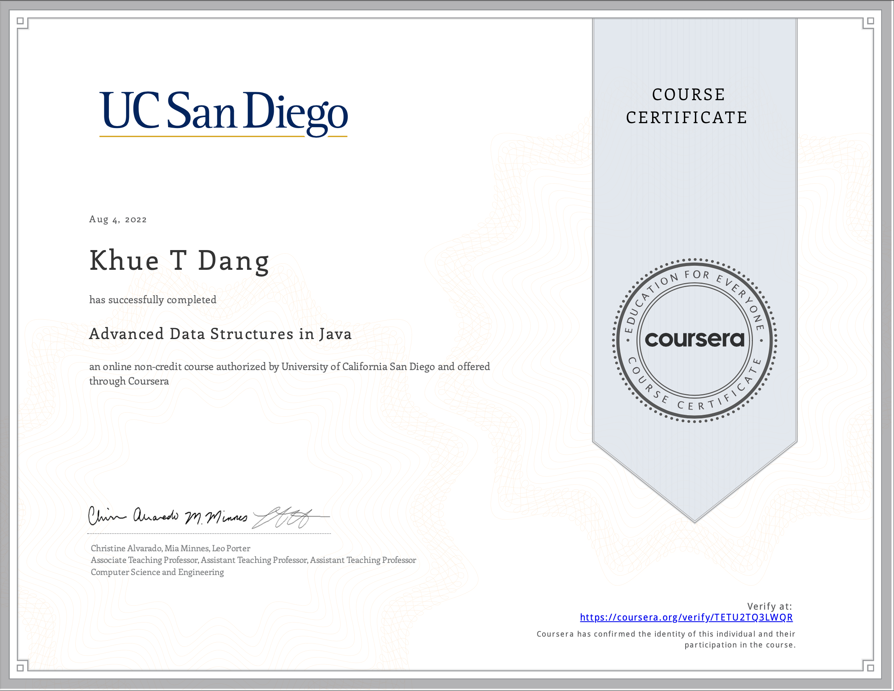

# Advanced Data Structures in Java

- This directory contains all of my assignments from the Coursera Course: [Advanced Data Structures in Java](https://www.coursera.org/learn/advanced-data-structures?specialization=java-object-oriented)

- The project I have completed during this course is called UCSDGraphs with the starter code provide by the instructors from UC San Diego

- The starter code of the project can be found at https://github.com/cjalvarado/Course3

# Proof of Completion



ucsd_graphs and UC San Diego/Coursera MOOC starter code
==================================================================

Starter Code and GUI Application for the Advanced Data Structures in Java course offered by UC San Diego through Coursera.

Authored by UCSD MOOC Team:
Mia Minnes, Christine Alvarado, Leo Porter, Alec Brickner and Adam Setters

Date: 12/16/2015

DESCRIPTION

The files provided are skeleton code, as well as grading previews and 
runtimebenchmark files to be used in completing the course programming 
assignments. Additionally, you are provided a runnable JavaFX program 
which will help to test and demonstrate your implementations.

FILES BY WEEK

Below are the files introduced in each week and used in each week of the course. See file for description...

Week 1 : Introduction to the course and graphs
```
basicgraph.Graph.java
basicgraph.GraphAdjList.java
basicgraph.GraphAdjMatrix.java
```

Week 2 : Class design and simple graph search
```
roadgraph.MapGraph.java
week2example.Maze.java
week2example.MazeLoader.java
week2example.MazeNode.java
```

Utility files
```
geography.GeographicPoint.java
geography.RoadSegment.java
util.GraphLoader.java
```

SETUP

Importing Project into eclipse:
	1. Create a new Java Project in your workspace
	2. Import the starter files:
	  File -> Import -> Select "File System" -> Next -> Browse and set 
	  root directory to folder contents of zip were extracted to -> Finish

Feel free to use another IDE or manually compile and run your programs. If you need help, google is your friend.